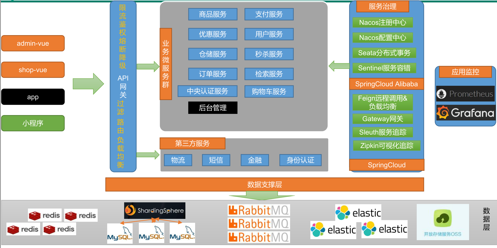

# 全栈微服务商城

### 项目 UI 来源 
- [uni-app实战商城类app和小程序](https://study.163.com/course/introduction/1209401825.htm)
### 项目 思想 来源 
- [Java项目《谷粒商城》Java架构师 | 微服务 | 大型电商项目](https://www.bilibili.com/video/BV1np4y1C7Yf)
- [云原生Java架构师的第一课K8s+Docker+KubeSphere+DevOps](https://www.bilibili.com/video/BV13Q4y1C7hS)

## 项目介绍

谷粒商城项目是一套电商项目，包括前台商城系统以及后台管理系统，
- 原项目基于 SpringCloud、SpringCloud Alibaba、MyBatis Plus实现。前台商城系统包括：用户登录、注册、商品搜索、商品详情、购物车、订单、秒杀活动等模块。后台管理系统包括：系统管理、商品系统、优惠营销、库存系统、订单系统、用户系统、内容管理等七大模块。
- 本项目使用 golang(go-micro) + php(laravel) + vue(vant)实现

> 支付模块使用以太币（`ethereum`） 需要在浏览器中安装 Metamask 插件 https://metamask.io/

## 架构图

### 系统架构图


### 业务架构图



## 📗 目录结构

```lua
├── admin                           # 后台
├── gateway                         # 服务网关
├── services                        # 所有服务
│   ├── cart                        # 购物车服务
│   ├── center                      # 中心服务
│   ├── market                      # 营销服务
│   ├── member                      # 会员服务
│   ├── order                       # 订单服务
│   ├── product                     # 产品服务
│   ├── seckill                     # 秒杀服务
│   ├── third-party                 # 第三方服务
│   ├── wallet                      # 钱包服务
│   ├── warehouse                   # 仓储服务
├── deploys                         # 部署相关
├── web                             # 前端
├── pkg                             # 公共类库
├── seed                            # 爬虫 - 填充商品数据
├── docker-compose.yml              # 一键安装所有服务
├── docker-compose-tool.yml         # 一键安装app所有工具
├── Makefile                        # 项目管理文件
├── sonar-project.properties        # sonarqube代码检查
```

### 后端技术 - golang

- 微服务框架 [go-micro](https://github.com/asim/go-micro)
- API网关 [grpc-gateway](https://github.com/grpc-ecosystem/grpc-gateway)
- grpc框架 [grpc](https://google.golang.org/grpc)
- consul服务注册中心 [consul](https://github.com/hashicorp/consul)
- 以太坊客户端 [go-ethereum](https://github.com/ethereum/go-ethereum)
- GRPC中间件 [middware](https://github.com/grpc-ecosystem/go-grpc-middleware) 
- 链路追踪 [opentelemetry](https://github.com/open-telemetry/opentelemetry-go)
  [jaeger](https://github.com/jaegertracing/jaeger)
- 数据库组件 [GORM](https://gorm.io)
- redis组件 [redis](https://github.com/go-redis/redis)
- 命令行工具 [Cobra](https://github.com/spf13/cobra)
- 文档使用 [Swagger](https://swagger.io/) 生成
- 配置文件解析库 [Viper](https://github.com/spf13/viper)
- 使用 [JWT](https://jwt.io/) 进行身份鉴权认证
- 校验器 [validator](https://github.com/envoyproxy/protoc-gen-validate)
- 包管理工具 [Go Modules](https://github.com/golang/go/wiki/Modules)
- CI/CD [GitHub Actions](https://github.com/actions)
- 使用 [GolangCI-lint](https://golangci.com/) 进行代码检测
- 使用 make 来管理 Go 工程

### 前端技术 - vue
- [入口](./web1111)
- 移动端 Vue 组件库 [vant](https://youzan.github.io/vant/#/zh-CN/)
- 脚手架 [vue-cli4 vant rem 移动端框架方案](https://github.com/sunniejs/vue-h5-template)

### 管理后台 - php
- [入口](./admin)
- laravel框架(5.5.*) [laravel文档](https://learnku.com/docs/laravel/5.5/installation/1282)
- laravel-admin后台框架 [laravel-admin文档](https://laravel-admin.org/)

### 数据填充 - python
- [入口](./seed)
- scrapy框架(latest) [scrapy](https://www.osgeo.cn/scrapy/)

## 环境搭建

### 开发工具

|     工具       |        说明         |                      官网                       |
| :-----------: | :-----------------: | :---------------------------------------------: |
| RedisDesktop  | redis客户端连接工具 |        https://redisdesktop.com/download        |
|    electerm   |  Linux远程连接工具  | https://github.com/electerm/electerm            |
|    Navicat    |   数据库连接工具    |       http://www.formysql.com/xiazai.html       |
| PowerDesigner |   数据库设计工具    |             http://powerdesigner.de             |
|    Postman    |   API接口调试工具   |             https://www.postman.com             |
|    Jmeter     |    性能压测工具     |            https://jmeter.apache.org            |
|    Typora     |   Markdown编辑器   |                https://typora.io                |

### 开发环境

| 工具           | 版本号    | 下载                                                           |
| ------------- |--------| ------------------------------------------------------------ |
| golang        | 1.20   | https://golang.org/dl/                                       |
| nodejs        | 18.15  | https://nodejs.org/zh-cn/download/                           |
| php           | 8.1    | https://www.php.net/downloads.php                            |
| python        | 3.9    | https://www.python.org/downloads/                            |
| solidity      | 0.8.0  | http://remix.ethereum.org/                                   |
| mysql         | 5.7    | https://www.mysql.com/                                       |
| redis         | 6.0    | https://redis.io/download                                    |
| nginx         | 1.19   | http://nginx.org/en/download.html                            |
| consul        | latest | https://github.com/hashicorp/consul                          |
| protobuf      | latest | https://github.com/protocolbuffers/protobuf                  |
| minio         | latest | http://docs.minio.org.cn/docs/                               |
| elasticsearch | 7.14.2 | https://www.elastic.co/cn/downloads/elasticsearch            |
| rabbitmq      | 3.9    | https://www.rabbitmq.com/download.html                       |

### 项目部署

### 手动编译部署

TIPS: 需要本地安装MySQL数据库和 Redis Consul minio rabbitmq elasticsearch
```bash
# 下载安装
git clone 

# 进入项目目录
cd micro-mall

# 进入单个子服务目录
make dev 
```

### docker部署 - 推荐
- [docker安装文档](https://docs.docker.com/engine/install/)
- [docker-compose安装文档](https://docs.docker.com/compose/install/)

```shell
# 部署
cd micro-mall
# 安装项目工具集
docker-compose -f docker-compose-tool.yml up -d

# 安装所有服务
# 前端项目默认api host：127.0.0.1，如需修改，请 vim frontend/Dockerfile
# minio 默认 host 127.0.0.1 可通过环境变量 MICRO_DFS_ENDPOINT 自定义
docker-compose up -d
```

## 📝 接口文档

- [接口文档](http://127.0.0.1:9520/swagger/index.html)
- [API网关](http://127.0.0.1:9520)
- [管理后台](http://127.0.0.1:8000)
- [前端界面](http://127.0.0.1)
- [prometheus](http://127.0.0.1:9090)
- [grafana](http://127.0.0.1:3000)
- [jaeger](http://127.0.0.1:16686)
- [consul](http://127.0.0.1:8500)
- [elasticsearch](http://127.0.0.1:9200)
- [rabbitmq](http://127.0.0.1:15672)


## 其他

- 开发规范: [Uber Go 语言编码规范](https://github.com/xxjwxc/uber_go_guide_cn)
- 代码扫描: [sonarqube install doc](https://docs.sonarqube.org/latest/setup/install-server/)